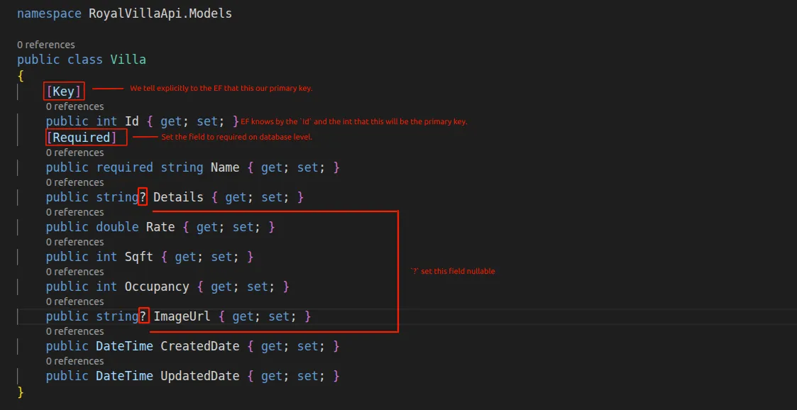

# RoyalVillaApi

ASP.NET Core minimal API project for the Royal Villa backend. It exposes API metadata in development through **OpenAPI** and an interactive reference UI powered by **Scalar**.

---

## Prerequisites

| Requirement | Notes |
|-------------|-------|
| [.NET SDK 10](https://dotnet.microsoft.com/download) | Target framework is `net10.0`. |
| [C# extension](https://marketplace.visualstudio.com/items?itemName=ms-dotnettools.csharp) | Recommended for Cursor / VS Code debugging (`coreclr`). |

Restore and build:

```bash
dotnet restore
dotnet build
```

---

## Run the application

For the most reliable results, start with an explicit launch profile and then follow the URLs printed in the console (`Now listening on: ...`).

| Profile | Command | URLs (see `Properties/launchSettings.json`) |
|---------|---------|-----------------------------------------------|
| **HTTPS** | `dotnet run --project RoyalVillaApi.csproj --launch-profile https` | `https://localhost:7274` and `http://localhost:5028` |
| **HTTP only** | `dotnet run --project RoyalVillaApi.csproj --launch-profile http` | `http://localhost:5028` |
| **Plain `dotnet run`** | `dotnet run` | Uses a launch profile automatically; verify with the `Now listening on:` output (may be HTTP). |

Ensure `ASPNETCORE_ENVIRONMENT` is **`Development`** when you want interactive docs (see below). The launch profiles already set this.

---

## Development-only features

These endpoints are registered only when the app runs in **`Development`**:

| Resource | Typical URL |
|----------|-------------|
| OpenAPI JSON | `https://localhost:7274/openapi/v1.json` (or `http://localhost:5028/openapi/v1.json`) |
| Scalar UI | `https://localhost:7274/scalar/` (or `http://localhost:5028/scalar/`) |

Production builds use **HSTS** and **HTTPS redirection**. OpenAPI and Scalar are not mapped outside Development.

Implementation notes:

- The OpenAPI document’s **`servers`** entry is aligned with each request’s scheme and host (`https://localhost:7274`, etc.).
- Scalar uses a **dynamic base server URL** so “try it” calls match how you loaded the UI (HTTP vs HTTPS).

---

## HTTPS development certificate

`https://localhost` uses ASP.NET Core’s **development HTTPS certificate**. Browsers warn until that certificate is trusted.

1. Generate or refresh trust:

   ```bash
   dotnet dev-certs https --trust
   ```

2. On **Linux**, you may also need extra steps so Chromium-based browsers trust the certificate. Microsoft documents this workflow here: **[Trust the HTTPS development certificate](https://aka.ms/dev-certs-trust)**. A common approach is installing the PEM from `~/.aspnet/dev-certs/trust/` into the system certificate store (`update-ca-certificates` on Debian/Ubuntu derivatives).

Use **`localhost`** in the URL, not `127.0.0.1`, so it matches the certificate.

---

## Debugging in Cursor / VS Code

The repository includes `.vscode/launch.json` and `.vscode/tasks.json`.

| Configuration | Purpose |
|----------------|---------|
| **RoyalVillaApi: Development (HTTPS)** | Build, then `dotnet run` with HTTPS profile + `Development` env. Optionally opens Scalar in the browser. |
| **RoyalVillaApi: Development (HTTP only)** | Same, HTTP-only profile (avoids local TLS warnings if you have not trusted the dev cert yet). |

Start debugging from the Run and Debug view or press **F5** after selecting a configuration.

---

## Project layout (high level)

| Path | Role |
|------|------|
| `Program.cs` | Minimal hosting pipeline: OpenAPI, EF Core (`AddDbContext<AppDbContext>` + PostgreSQL), HTTPS, development docs. |
| `Properties/launchSettings.json` | Local Kestrel URLs and environment variables per profile. |
| `Data/AppDbContext.cs` | EF Core `DbContext`; register entities with `DbSet<>` when you add models. |
| `RoyalVillaApi.csproj` | SDK, TFMs, packages (OpenAPI, Scalar, EF Core, Npgsql provider, AutoMapper). |
| `RoyalVillaApi.http` | Sample REST client snippets (optional IDE support). |

---

## Packages

- **Microsoft.AspNetCore.OpenApi** — Generates and serves the OpenAPI document.
- **Scalar.AspNetCore** — Embeds Scalar for browsing and testing API operations in development.
- **Microsoft.EntityFrameworkCore** — ORM and change tracking for database access.
- **Microsoft.EntityFrameworkCore.Design** — Design-time support for EF Core (for example `dotnet ef` migrations); referenced with private assets so it is not published with the app.
- **Npgsql.EntityFrameworkCore.PostgreSQL** — EF Core database provider for PostgreSQL.
- **AutoMapper** — Maps between domain models (for example `Villa`) and DTOs (for example `VillaCreateDTO`) so controllers stay thin. Dependency injection is built into the main package (`services.AddAutoMapper(...)` in `Program.cs`).

Install or update AutoMapper from the project directory:

```bash
dotnet add package AutoMapper
```

---

## Contributing

Describe your branch naming, PR process, or coding standards here as your team settles them.

---

## License

Add your license choice for this repository (for example MIT, proprietary, etc.).

---

## Installation steps

Follow these steps to install dependencies and align your machine with what this repository already configures in code.

### 1. Install the .NET SDK

Install [.NET SDK 10](https://dotnet.microsoft.com/download) (the project targets `net10.0`). Confirm with:

```bash
dotnet --version
```

### 2. Install and run PostgreSQL

Install PostgreSQL on your machine and start the database service. Create a database for this API (name should match `Database=` in your connection string, for example `royalvilla`):

```bash
createdb royalvilla
```

Alternatively, in `psql`:

```sql
CREATE DATABASE royalvilla;
```

### 3. Configure the connection string

The app reads **`ConnectionStrings:DefaultConnection`** from configuration (see `appsettings.json`). Use an [Npgsql connection string](https://www.npgsql.org/doc/connection-string-parameters.html), for example:

```text
Host=localhost;Port=5432;Database=royalvilla;Username=YOUR_USER;Password=YOUR_PASSWORD
```

Adjust `Port`, `Username`, and `Password` for your local instance. For production or shared repos, prefer [user secrets](https://learn.microsoft.com/en-us/aspnet/core/security/app-secrets) or environment variables instead of committing passwords.

### 4. Restore and build

From the directory that contains `RoyalVillaApi.csproj` (the same folder as this README):

```bash
dotnet restore
dotnet build
```

### 5. (Optional) EF Core CLI for migrations

If you plan to manage the schema with migrations, install the global EF tool once:

```bash
dotnet tool install --global dotnet-ef
```

After you add entity types and `DbSet<>` mappings to `Data/AppDbContext.cs`, you can create and apply migrations. Seed data for villas is configured in that file (`OnModelCreating` / `HasData`); see [Migrations and seed data](#migrations-and-seed-data) below. Example:

```bash
dotnet ef migrations add InitialCreate
dotnet ef database update
```

`dotnet ef database update` applies pending migrations to PostgreSQL and records them in `__EFMigrationsHistory`.

### What this repository already wires up

You do not need to repeat these steps unless you are recreating the setup from scratch; they document the current codebase:

| Area | What is configured |
|------|--------------------|
| **Packages** (`RoyalVillaApi.csproj`) | `Microsoft.EntityFrameworkCore` (10.0.7), `Microsoft.EntityFrameworkCore.Design` (10.0.7, private assets), `Npgsql.EntityFrameworkCore.PostgreSQL` (10.0.0), `AutoMapper`, plus OpenAPI and Scalar packages. |
| **`Program.cs`** | `AddDbContext<AppDbContext>` with Npgsql; controllers and OpenAPI registration. |
| **Object mapping** | **AutoMapper** — `dotnet add package AutoMapper`, then `services.AddAutoMapper(...)` in `Program.cs` and `IMapper` in controllers to map entities and DTOs. |
| **`Data/AppDbContext.cs`** | `AppDbContext`, `DbSet<Villa>`, and **seed data** via `OnModelCreating` → `HasData(...)` (five default villas). |

Until you add models and query the context at runtime, the API will build without contacting PostgreSQL; any endpoint that uses `AppDbContext` will require PostgreSQL to be running and the connection string to be valid.

### Migrations and seed data

Initial villa rows are defined in **`Data/AppDbContext.cs`**, inside `OnModelCreating`, using EF Core’s `HasData` API. That configuration is compiled into migration files under `Migrations/` (for example `SeedVillas`). After you change seed data in `AppDbContext`, create a new migration and apply it so the database and history table stay in sync.

| Step | Command | What it does |
|------|---------|----------------|
| Add a migration | `dotnet ef migrations add <MigrationName>` | Generates C# migration classes from the current model (including `HasData` changes). |
| Apply to the database | `dotnet ef database update` | Runs pending migrations: creates or alters tables, inserts seed rows, and **adds one row per applied migration to `__EFMigrationsHistory`**. |
| Apply up to a specific migration | `dotnet ef database update <MigrationName>` | Same as above, but stops after the named migration. |
| List migrations | `dotnet ef migrations list` | Shows migrations on disk and which are recorded in `__EFMigrationsHistory`. |

Run these from the folder that contains `RoyalVillaApi.csproj` (after `dotnet tool install --global dotnet-ef` if needed). Example end-to-end after editing seed data in `Data/AppDbContext.cs`:

```bash
dotnet ef migrations add SeedVillas
dotnet ef database update
```

`dotnet ef database update` is the command that executes migrations against PostgreSQL: it updates schema and data (including seed `INSERT`s) and records each migration in **`__EFMigrationsHistory`** so EF Core knows which migrations have already run.

On application startup, **`Program.cs`** also calls `Database.MigrateAsync()`, which applies any pending migrations the same way (including updating `__EFMigrationsHistory`). For local development you can rely on either `dotnet ef database update` or simply running the API once both are configured.

### Migration related information in C#



