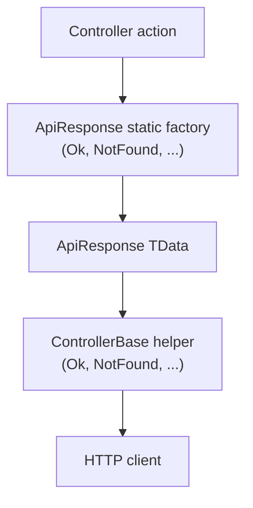

# ApiResponse envelope and static factories

Why the Royal Villa API wraps HTTP bodies in **`ApiResponse<TData>`** and builds them with **static factory methods** (`Ok`, `BadRequest`, `NotFound`, and so on) instead of hand-written anonymous objects or raw DTOs at the root of every response.

## The problem with manual response shapes

Before the envelope, each action could return a different JSON shape: a bare array on list, a single entity on get, a string on error, or ad-hoc properties like `{ "error": "..." }`. That forces clients to branch on endpoint and HTTP status, and makes it easy for two actions to disagree on field names or status semantics.

Example of a **manual** error body (repeated in every action):

```csharp
return BadRequest(new {
    success = false,
    message = "Id is required",
    statusCode = 400
});
```

Problems:

1. **Inconsistent** — Typos in property names (`Success` vs `success`) or missing fields differ per action.
2. **Duplicated** — Every controller action re-declares the same wrapper properties.
3. **Drift** — Adding `timestamp` or `errors` means editing many places; some actions get left behind.
4. **Weak typing** — Anonymous types do not document `Data` as `VillaDTO` in the method signature or in OpenAPI as clearly as `ActionResult<ApiResponse<VillaDTO>>`.

## The uniform envelope

`ApiResponse<TData>` in `Models/DTO/ApiResponse.cs` defines one contract for every outcome:

| Property      | Role |
|---------------|------|
| `Success`     | Whether the operation succeeded (client can check without inferring from HTTP status alone). |
| `StatusCode`  | Mirrors the intended HTTP status inside the body (useful for logging and clients that read body first). |
| `Message`     | Human-readable summary (`"Villa fetched successfully"`, error text, etc.). |
| `Data`        | Payload on success (`VillaDTO`, collections, or `null` on errors / 204). |
| `Errors`      | Optional validation or metadata (e.g. list of field messages, `CreatedAtAction` route hints). |
| `Timestamp`   | UTC time when the response was created (set on the type; factories use `Create` for the rest). |

Success and failure responses share the same top-level keys, so a front end or mobile app can deserialize once:

```json
{
  "success": true,
  "statusCode": 200,
  "message": "Villa fetched successfully",
  "data": { "id": 1, "name": "..." },
  "errors": null,
  "timestamp": "2026-05-17T12:00:00Z"
}
```

## Why static factories instead of `new ApiResponse<T>(...)`

Factories centralize how each HTTP scenario is built.

### 1. Single source of truth

`Create` sets `Success`, `StatusCode`, `Message`, `Data`, and `Errors` together. Named methods encode the right status:

```csharp
ApiResponse<VillaDTO>.Ok(dtoResponse, "Villa fetched successfully");
ApiResponse<VillaDTO>.NotFound($"Villa with id {id} not found");
ApiResponse<VillaDTO>.Conflict($"Villa with name {name} already exists");
```

You do not repeat `StatusCodes.Status404NotFound` and `success: false` in every `NotFound` call.

### 2. Correct status codes by convention

`BadRequest`, `NotFound`, `Conflict`, `InternalServerError`, `CreatedAtAction`, and `NoContent` map to the standard ASP.NET Core status constants. That reduces mistakes such as returning HTTP 404 with `statusCode: 400` in the body.

### 3. Less noise in controllers

`VillaController` stays focused on validation, EF Core, and mapping. Responses are one line:

```csharp
return Ok(ApiResponse<VillaDTO>.Ok(dtoResponse, "Villa updated successfully"));
return NotFound(ApiResponse<VillaDTO>.NotFound($"Villa with id {id} not found"));
```

Compare to constructing the full object inline on every branch.

### 4. Type-safe payloads

`ApiResponse<IEnumerable<VillaDTO>>` vs `ApiResponse<VillaDTO>` vs `ApiResponse<object?>` for delete documents what lives in `Data`. Refactoring tools and the compiler catch misuse of the wrong generic argument.

### 5. Easier evolution

New cross-cutting behavior (default message, logging hook, correlation id) can be added in `Create` or specific factories once, not in every action.

### 6. OpenAPI and documentation

`ActionResult<ApiResponse<VillaDTO>>` signals to Swagger/Scalar that the response body is always the envelope. XML remarks on `VillaController` reference `ApiResponse<TData>` and the factories used per action.

## How Villa endpoints use factories

| Action           | Typical factories |
|------------------|-------------------|
| `GetVillas`      | `Ok`, `InternalServerError` |
| `GetVillaById`   | `Ok`, `BadRequest` (with `errors`), `NotFound`, `InternalServerError` |
| `CreateVilla`    | `BadRequest`, `Conflict`, `CreatedAtAction`, `InternalServerError` |
| `UpdateVilla`    | `BadRequest`, `NotFound`, `Conflict`, `Ok`, `InternalServerError` |
| `DeleteVilla`    | `BadRequest`, `NotFound`, `NoContent`, `InternalServerError` |

ASP.NET Core helpers (`Ok`, `BadRequest`, `NotFound`, `Conflict`, `StatusCode`) still set the **HTTP** status line; the factory sets the matching **body** fields so wire status and envelope stay aligned.

## Mental model



1. Business logic produces a DTO (or error message).
2. A factory builds `ApiResponse<TData>` with the right flags and status.
3. `Ok(...)` / `NotFound(...)` / etc. attach that object to the HTTP response.

## Summary

Using **`ApiResponse<TData>`** with **static factories** gives the API a **consistent, typed, maintainable** response contract. Clients parse one shape; controllers avoid copy-pasted anonymous objects; status codes and messages stay aligned with HTTP semantics. For implementation details, see `Models/DTO/ApiResponse.cs` and the XML remarks on `Controllers/VillaController.cs`.
