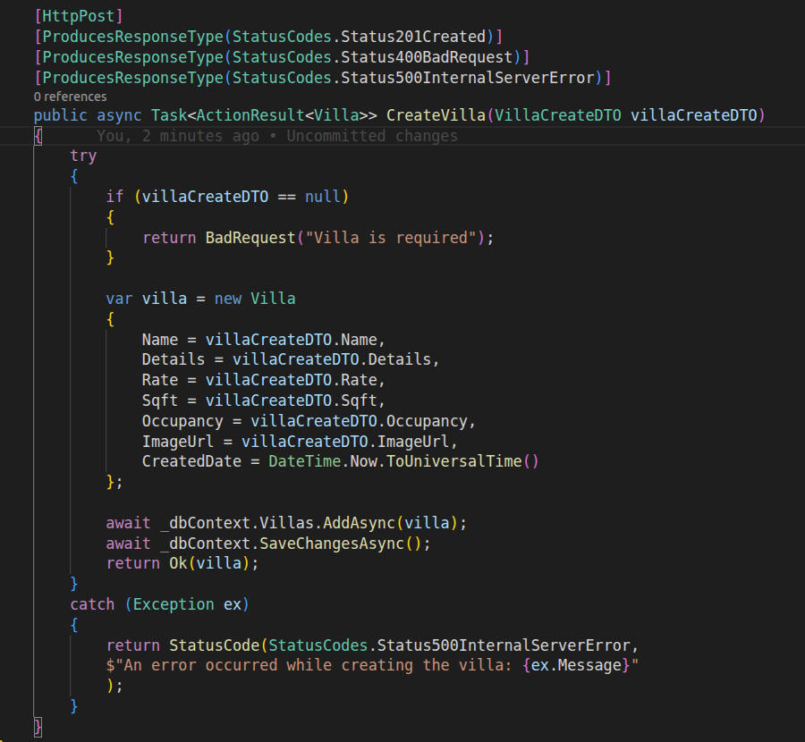
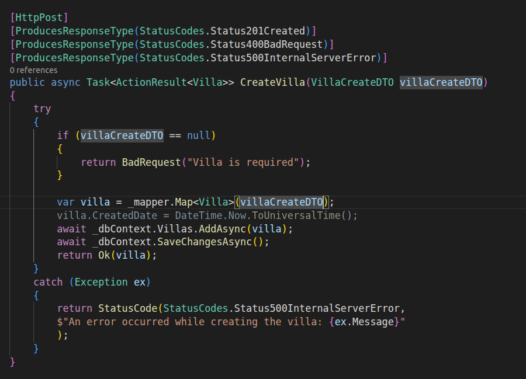

# AutoMapper and DTOs

Why **Data Transfer Objects (DTOs)** and **AutoMapper** belong together in the Royal Villa API, and how they simplify controller code when creating resources.

## Why use a DTO?

The API exposes `VillaCreateDTO` for `POST` requests instead of binding directly to the `Villa` entity.

| Concern | `VillaCreateDTO` | `Villa` entity |
|---------|------------------|----------------|
| **Audience** | HTTP clients (request body) | Database / domain model |
| **Identity** | No `Id` — generated on save | Has `Id` (primary key) |
| **Audit fields** | Omitted from input | `CreatedDate`, `UpdatedDate` |
| **Validation** | Input rules (`[Required]`, `[MaxLength]`) | Persistence and business rules |

DTOs keep the **public contract** separate from the **persistence model**. Clients send only what they are allowed to set; server-owned fields stay off the wire.

In this project, `VillaCreateDTO` lives under `Models/DTO/` and maps to `Villa` in `Models/Villa.cs`.

## Manual mapping (without AutoMapper)

Before AutoMapper, every property had to be copied by hand from the DTO into a new entity:



Problems with this approach:

1. **Repetitive** — One assignment per property; noise grows with every new field.
2. **Error-prone** — Easy to skip a property, typo a name, or map to the wrong target.
3. **Hard to maintain** — Adding `Amenities` to both DTO and entity means updating mapping code in every action that creates or updates a villa.

## Mapping with AutoMapper

AutoMapper maps types with matching property names in one line:



```csharp
var villa = _mapper.Map<Villa>(villaCreateDTO);
```

The controller stays focused on validation, persistence, and HTTP responses instead of boilerplate assignments.

### Configuration in this API

Registration is in `Program.cs`:

```csharp
builder.Services.AddAutoMapper(cfg =>
{
    cfg.CreateMap<VillaCreateDTO, Villa>();
});
```

`VillaController` receives `IMapper` via constructor injection and uses it in `CreateVilla`:

```csharp
public VillaController(AppDbContext dbContext, IMapper mapper)
{
    _dbContext = dbContext;
    _mapper = mapper;
}
```

Properties that exist on **both** `VillaCreateDTO` and `Villa` with the same name (`Name`, `Details`, `Rate`, `Sqft`, `Occupancy`, `ImageUrl`) are copied automatically. Properties only on `Villa` — such as `Id`, `CreatedDate`, and `UpdatedDate` — are left at default values unless you configure or set them explicitly after mapping (for example `villa.CreatedDate = DateTime.UtcNow` before `SaveChangesAsync`).

## DTO + AutoMapper flow


1. Client sends JSON matching `VillaCreateDTO`.
2. ASP.NET Core binds the body to `villaCreateDTO`.
3. `_mapper.Map<Villa>(villaCreateDTO)` builds a `Villa` instance.
4. Optional: set server-only fields, then `AddAsync` and `SaveChangesAsync`.

## Comparison

| | Manual mapping | AutoMapper |
|---|----------------|------------|
| Lines per create action | ~7+ property assignments | 1 map call |
| New shared property | Update every manual block | Often zero change if names match |
| Custom rules | Inline in controller | Profiles, `ForMember`, value resolvers |
| Learning curve | None | Package + profile setup |

## When AutoMapper is not enough

Use explicit code or profile rules when:

- Property names differ between DTO and entity (`Price` vs `Rate`).
- You need computed or conditional values.
- You must ignore or transform specific members.

For simple create/update shapes with aligned names — as with `VillaCreateDTO` → `Villa` — convention-based mapping is enough.

## Summary

| Question | Answer |
|----------|--------|
| Why a DTO for create? | Control what clients can send; hide keys and audit columns. |
| Why AutoMapper? | Remove repetitive property copying; reduce mapping bugs. |
| What gets mapped automatically? | Same-named properties on source and destination. |
| What stays manual? | Server defaults, timestamps, and any renamed or computed fields. |

Together, DTOs define a safe API surface; AutoMapper keeps the translation from that surface to entities short and consistent.
